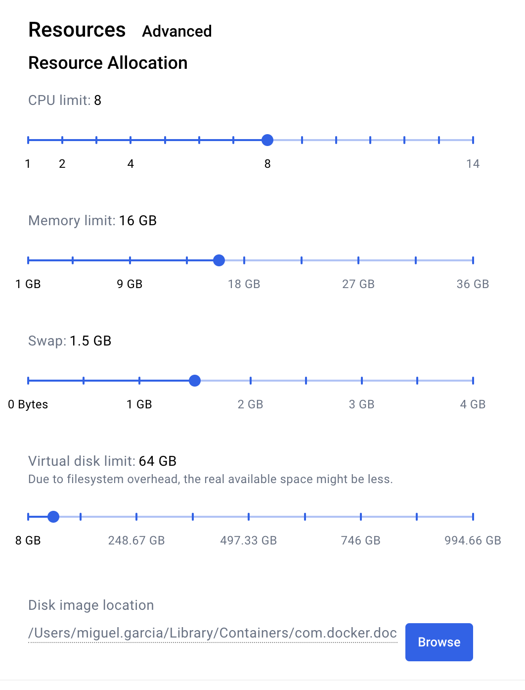
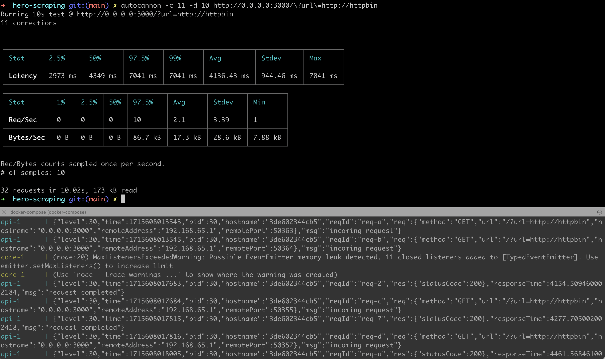
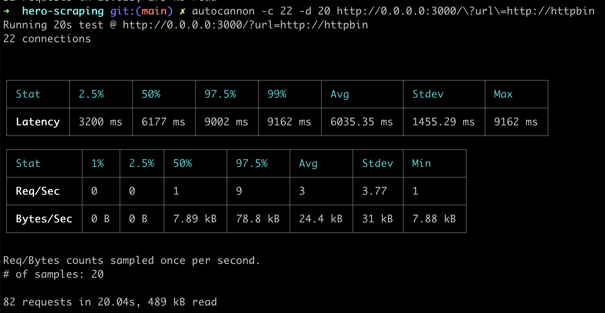
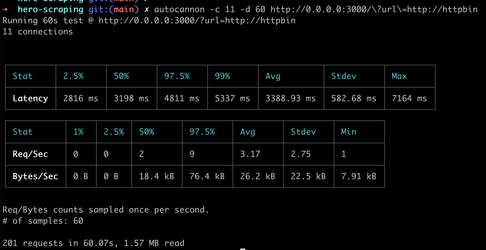
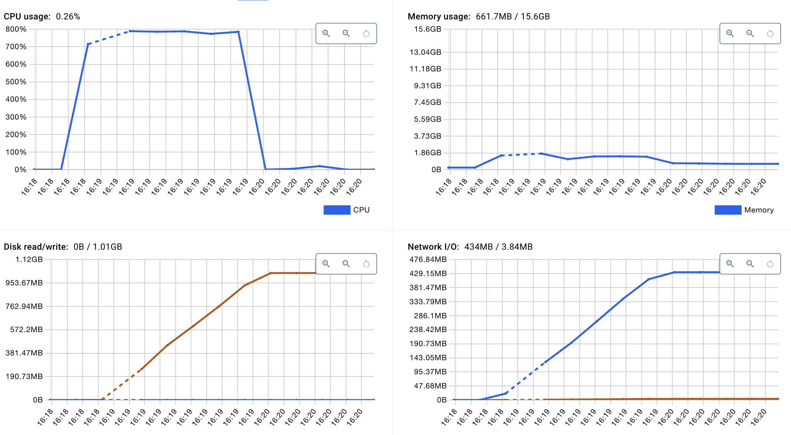

# Overview

## Usage

`docker-compose up`

Go to: http://0.0.0.0:3000/?url=http://httpbin

`npm install autocannon`

Test exceeding concurrency

`autocannon -d 10 -c 11 http://0.0.0.0:3000/?url=http://httpbin`

